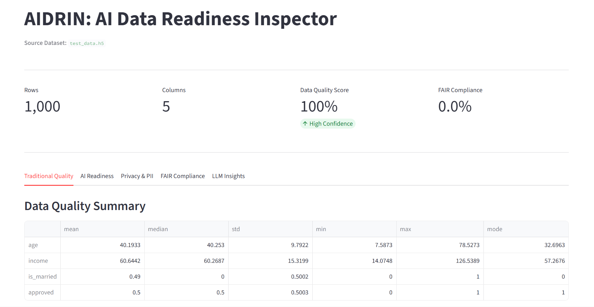
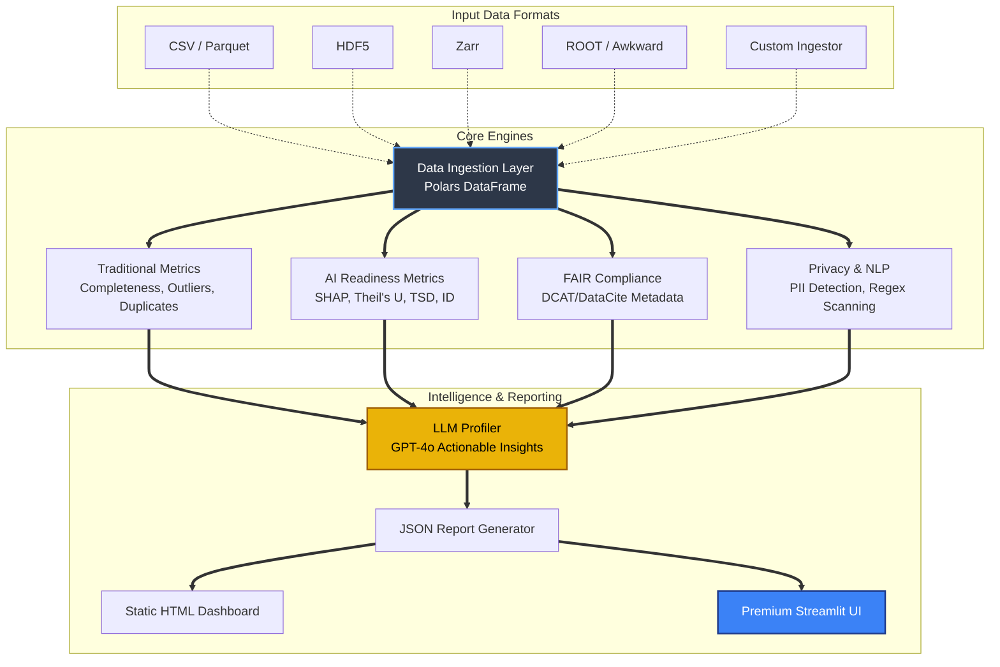

<h1>AIDRIN: AI Data Readiness Inspector</h1>
<p><strong>A framework providing quantifiable data readiness assessments for Artificial Intelligence pipelines.</strong></p>

## The Problem: Garbage In, Garbage Out (GIGO)

"Garbage In, Garbage Out" is a foundational principle in computer science, particularly in the realm of Artificial Intelligence and Machine Learning. An AI model is only as good as the data it is trained on. When teams use low-quality, biased, or improperly formatted data, the resulting predictive models are inherently flawed, leading to severe consequences in production environments.

Computer scientists currently spend an exorbitant amount of time manually analyzing data to prepare it for AI. 

## The Solution: AIDRIN

**AIDRIN** (AI Data Readiness INspector) automates the quantifiable assessment of data, analyzing it across multiple dimensions from published academic literature. 

Rather than relying on disjointed scripts, AIDRIN provides a cohesive platform that runs extensive evaluations spanning traditional data quality, AI-specific statistical readiness, privacy (PII detection), and FAIR principles compliance. Evaluated natively over blazing-fast frameworks like `polars`, AIDRIN is designed to handle high-performance computing data structures commonly found in massive enterprise and scientific ML pipelines.

### Interactive Dashboard
AIDRIN comes with a dashboard for exploring the generated Readiness JSON reports.



---

## System Architecture

AIDRIN is designed with a modular, extensible architecture consisting of four core engines feeding into the Profiler and Reporting layers.



---

## Key Features & Capabilities

### 1. Multi-Format High-Performance Ingestion
AIDRIN breaks away from the limitations of standard Pandas and CSV structures by leveraging `polars` and `awkward-array` to load multi-dimensional and complex hierarchical data environments:
- **Zarr**: Chunked, compressed, N-dimensional arrays.
- **ROOT**: Standard High-Energy Physics format (via `uproot`).
- **HDF5**: Extensively used in scientific computing (via `h5py`).

### 2. Traditional Data Quality Inspection
- **Completeness**: Ratio of missing values (NaN, Null) matrix.
- **Outliers**: Distribution bounds checked dynamically against the Interquartile Range (IQR).
- **Duplication**: Hash-based row and strict value duplication metrics.
- **Summary Statistics**: Automated aggregation of mathematical foundations (Mean, Median, Std, Mode).

### 3. AI-Specific Data Dimensions (Paper Compliance)
These metrics are aligned specifically with state-of-the-art data literature:
- **Feature Importance (SHAP)**: Analyzes target correlation using Random Forest structural Shapley values.
- **Information Flow (Theil's U)**: Tracks asymmetrical categorical relationships securely alongside base Pearson analytics.
- **Algorithmic Fairness (TSD)**: Uses the Target Standard Deviation (TSD) mathematical model to measure historical prediction biases across protected multivariate groups.
- **Class Skewness (ID)**: Quantifies the structural Imbalance Degree away from uniform class assumptions.

### 4. Semantic Intelligence & Security
- **PII Detection**: Automatically scans columns and textual rows against extensive regex classifiers to flag sensitive entities (SSNs, Emails, Phone Numbers, Credit Cards).
- **FAIR Compliance**: Generates metadata dictionaries and matches them across the core DCAT and DataCite frameworks to ensure data is Findable, Accessible, Interoperable, and Reusable.
- **Generative Insights**: Injects the entire mathematical readiness profile into a connected LLM (e.g., GPT-4o) to output actionable NLP strategies for preparing the data to be trained.

---

## Installation & Usage

1. **Clone the repository and install dependencies:**
   ```bash
   git clone https://github.com/your-username/AIDRIN.git
   cd AIDRIN
   python3 -m venv .venv
   source .venv/bin/activate
   pip install -e .
   ```

2. **(Optional) LLM Context Validation:**
   Create a `.env` file in the root directory to generate Actionable Insights:
   ```env
   OPENAI_API_KEY=sk-your-key-here
   ```

3. **Run the Profiler CLI:**
   Evaluate a scientific High-Energy Physics HDF5 dataset natively targeting an income demographic while guarding gender logic:
   ```bash
   aidrin test_data.h5 --format hdf5 --dataset dataset1 --target target_income --protected gender
   ```

4. **Launch the Premium Visualizer:**
   Read the output JSON to render the Streamlit Dashboard.
   ```bash
   streamlit run aidrin/report/streamlit_app.py --server.port 8501 aidrin_report.json
   ```

---

## GSoC Proposal Context

This repository represents the prototype implementation targeted for Google Summer of Code 2026. 

**Mentors**: Jean Luca Bez and Suren Byna. 

This prototype explicitly implements the requested architectural modules representing Data Quality, Structural Reliability, Understandability, Value, Fairness, Bias, and Governance. The architecture maps perfectly against the proposed 350-hour timeline implementation strategies.
